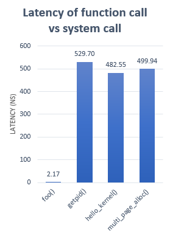
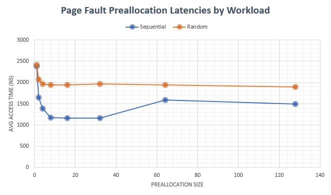

# System Call & Page Fault Benchmark

This project explores the cost of system calls and virtual memory page faults in the Linux kernel. This is a sister repository for the branch https://gitlab.com/chakshutandon/linux-stable/tree/mm-bench.

# Getting Started

Clone Patched Kernel:
```
git clone https://gitlab.com/chakshutandon/linux-stable.git
cd linux-stable
git checkout mm-bench
```

Compile:
```
make -j$(nproc)
```
> Note: Appropriate .config may be needed.

Run using QEMU (optional):
```
sudo qemu-system-x86_64 -kernel $KERNEL_IMG -drive format=raw,file=$QEMU_IMG -m $QEMU_MEM -nographic -append 'root=/dev/sda rw console=ttyS0' -enable-kvm
```
> Note: $KERNEL_IMG refers to build output located in linux-stable/arch/x86/boot/bzImage

Clone Benchmarks:
```
git clone https://gitlab.com/chakshutandon/syscall_page_fault_bench.git
 cd syscall_page_fault_bench
 ```

Compile:
```
gcc -o syscall syscall.c
gcc -o pagefault pagefault.c
```

Run:
```
./syscall
./pagefault
```
> Note: Make sure to run benchmarks a couple times to get the most accurate results.

# Analysis

## Measuring System Call Latency

The first part of the analysis is concerned with benchmarking the cost of a system call. Generally, a system call is much more expensive than a function call due to a change in privilege mode along with preserving process state.

A dummy function *foo()* is created in user-mode.

One of the simplest system calls in Linux is the *getpid()* call. Along with a few other bookkeeping tasks, it looks into the current running process and returns the process identifier.

An empty system call *hello_kernel()* was added to the Linux kernel which returns immediately after execution. This call helps establish the minimum latency of a swtich into kernel processing mode and back in user mode.

Another system call *multi_page_alloc()* was added which will be used in the analysis of page fault preallocation.

Using clock_gettime(CLOCK_REALTIME, ...), each of the functions were called one million times. In the case of *getpid()*, it's corresponding syscall() handler was called instead to avoid glibc (v2.3.4 - v2.24) from using vDSO optimizations in user-mode. Syscall() was also used for the new system calls as they are not part of the standard C library.

The following figure shows the average time taken by each of the calls listed above.



*__Figure 1.__ Latency of a function call compared to various system calls in the Linux kernel. System call is about x250 times as expensive as function call. Latency is measured in nanoseconds.*

As shown in the figure, the cost of a system call is significantly higher than a function call. The null *hello_kernel()* call along with *multi_page_alloc()* are not much different in terms of latency with regard to *getpid()*. Further analysis could compare these results to existing more expensive system calls like *read()*.

## Measuring Page Fault Cost

The methodology for measuring page fault cost was quite simple. A large 2GB *mmap()* region of PRIVATE, ANONYMOUS memory is allocated. Due to the on-demand paging system used by Linux, this region is not allocated in physical memory until it is accessed for the first time.

Touching an element of the memory region causes the hardware to raise a page fault which is caught by the operating system. By measuring the average time taken to write every page within the *mmap()* region, the overhead of a page faults can be obtained.

A random access pattern is also useful as this can illustrate the access times of some graph applications and non-sequential workloads. One thing to note, these random accesses must be predetermined outside the timing function as the *rand()* function itself is an expensive call.

As expected, the latency of random and sequential page accesses is not affected much in the default page allocation behavior of the Linux kernel. The following section discusses the changes that were made to reduce the page fault handling cost.

## Reducing Page Fault Cost

This section discusses the changes made to the Linux kernel to reduce page fault handling cost. The role of operating systems is to provide a safe virtual abstraction of physical memory across different processes. Virtual memory gives the illusion of contiguous regions of address space while the reality may be very different. Linux as well as many modern operating systems use paging to solve the problem of virtual memory. Paging can also refer to swapping memory regions to disk but is not explicitly discussed here.

When an application accesses a memory address, it must be translated to a physical memory address. This must be done safely as an arbritrary process should not be able to read/write to another processes memory. When the hardware is not sure that a memory page belongs to the current process, it must seek help from the operating system. The OS is responsible for maintaining page tables which contain the translations from physical to virtual address space. In the current version of Linux, when the processor does not find a valid translation, the kernel must allocate a page through a page fault handler. For large memory regions (like the benchmark), these page fault overheads can add up.

Once a memory translation is installed into the operating system page tables along with the cached TLB entry and hardware prefetching, the cost of accessing memory sequentially is on the order of a few nanoseconds.

This project aims to reduce the page fault handling cost by preallocating multiple pages during a page fault event, amortizing the overall cost of page accesses. This can be wasteful if only a small region of memory is required and thus must be done only in certain situations.

A new system call *multi_page_alloc()* is added which signals to the page fault handler the number of pages that should be preallocated during each page fault. The steps for a multiple page allocation is outlined below.

1. A "*struct vm_fault*" is caught by *do_anonymous_pages()*
2. If the WRITE flag is not set, allocate a number of preallocated zero-page entries
3. If the WRITE flag is set, allocate a number of last level ptes and zeroed-movable-user pages corresponding to the virtual addresses
4. Make an entry for each of the new pages
5. Install the entry into the allocated ptes with the corresponding virtual addresses
6. Update the memory-management-unit (MMU) cache
7. Return to user-mode

The figure below shows the results of running the user-mode benchmark with various preallocation sizes and workloads.



*__Figure 2.__ Average access time of a 2GB mmap() region with various page fault preallocation sizes. Access latencies are given for a sequential and random access workload. Latency is measured in nanoseconds.*

From the figure, preallocation of pages during a page fault does significantly reduce access latency if all the pages are accessed. For a sequential workload, a preallocation size of 16-32 pages is optimal. Here, the overall cost of page fault handling is amortized to 50% of the total cost. This can significantly impact application performance that use sequential accesses of large memory regions. There are diminishing returns for large preallocation sizes as the work needed to setup the pages is quite large.

For the random workload, there is still a decrease in access latency as fewer total page faults are generated. For applications that use small memory regions randomly, we should expect worse performance along with increased memory usage.

# Final Remarks

With simple modifications to the Linux kernel, it is shown that system calls are quite expensive compared to user-mode function calls and should be avoided  as much as possible. There is growing effort to move some traditional system call services into userspace with designs such as vDSO and microkernels. While some of these exist in the Linux kernel, it is up to developers to ensure they are not using excessive calls to the operating system.

Secondly, it is possible to reduce page fault handling cost by preallocating pages in response to page faults. This has the potential of increasing application performance by up to 50%.

The implementation of these benchmarks and Linux kernel code is far from complete. These are meant as a learning tool and serve as a starting point for further optimization. A few bugs exist in the implementation of *do_anonymous_pages()* which may be fixed in future releases.

## Bugs

1. Bad rss-counter state https://gitlab.com/chakshutandon/linux-stable/blob/mm-bench/mm/memory.c#L3198
2. Occasional memory-leak problems with Ext4 filesystem and buddy-allocator

# Authors

Chakshu Tandon <chakshutandon@gmail.com>: https://chakshutandon.com